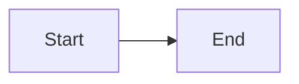

# 2nde-Chap-00-Docs-Aide-Editeur-Markdown

Tags : 2nde/00-Docs/Aide-Editeur-Markdown


[Example](@note/Example.md)


Inline ^[Inline content]
<markdown>
<details open>
<summary>Summary...</summary>
<markdown>
- Embedded
- _Markdown_
</markdown>
</details>

Inline ^[Inline content]

$\eqslantless$
$\eqslantgtr$

$\lvert -3 \rvert =3$

$\fcolorbox{red}{aqua}{F=ma}$


$\fcolorbox{red}{yellow}{F=ma}$


$\bot$

$\hearts$

$\bullet$

$\forall x  \in  \notin  \exists \nexists /  \varnothing$

$\pm$ $\approx$ $\not =$

$\text{if }$

$\begin{cases}    a b  \\   c d  \end{cases}$

& 


```Python
```js
// Fenced JS code block
```

> Quotation
> > Nested quotation

<div>
	<fieldset style="border: dotted 1px black; border-radius: 5px;">
  		<legend>Porte d'entrée</legend>
		<br><br>
	</fieldset>
</div>

$⇔	 \begin{vmatrix}    x+2 & y \\   2 & 1   \end{vmatrix} =0$


$\underbrace{a+b+c}_{\text{note}}$

+ [ ] Unchecked task
* [x] Checked task
- [ ] Nested
- [x] Checked
- [ ] Task


