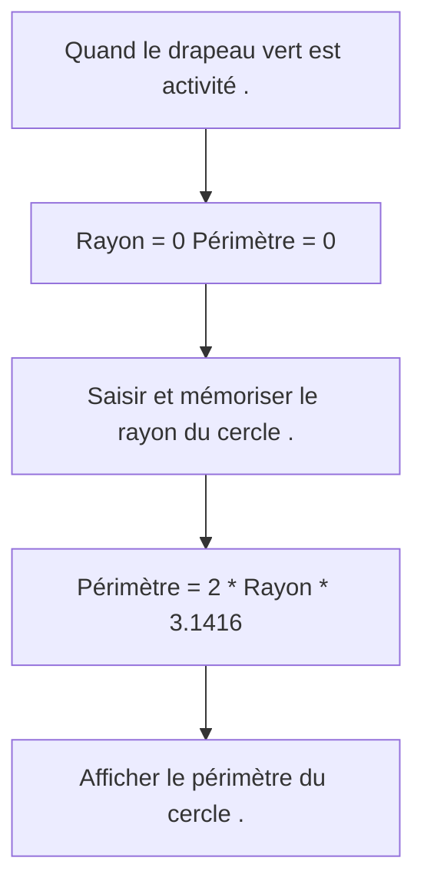

# Theme-03-Cours-Algorithmique-Et-Programmation-1

**Notion d’algorithme et de programme**

**la fin du thème, tu dois savoir :**

* Définition d’un algorithme
* Vocabulaire : initialisation – traitement de données – sortie – résultat
* Définition d’un programme
*  Découvrir scratch : Guide de programmation

### A -   DEFINITION D’UN ALGORITHME

<markdown>
Un **algorithme** est une suite d’**instruction** à appliquer dans un ordre logique pour résoudre un problème 
et obtenir rapidement un résultat. 
Il est écrit à la main ou à l’aide d’un logiciel dans un langage compréhensible par tous.
</markdown>

 

Un **algorithme** sert à préparer l’écriture d’un **programme** informatique

**Exemple :**   
« La recette pour la fabrication de cookies » 

**Ingrédients pour 8 cookies**
* Beurre : 25 g
* Sucre : 25 g
* œufs: 2
* Levure : 3 g
* Farine : 40 g
* Chocolat : 30 g de pépites de chocolat

**Préparation**

1. Faire ramollir le beurre.
2. Ajouter le sucre, les œufs, la levure et mélanger.
3. Répandre la farine tout en pétrissant afin que la pâte
soit bien homogène.
4. Incorporer les pépites de chocolat.
5. Former de petites boules avec la pâte à cookies que
vous disposerez sur une plaque.
6. Enfourner pendant 10 minutes.

### B -   VOCABULAIRE

Un algorithme est souvent constitué de trois parties :

* **Première partie :** <u>**Initialisation**</u> ( on définit ce que l’on va avoir besoin )

* **Deuxième partie :** <u>**Traitement des données**</u>

* **Troisième partie : <u>** **Sortie**</u> ( Le résultat obtenu)
 

<u>**Exemple :**</u>   « La recette pour la fabrication de cookies » 

* **Initialisation** : Les ingrédients pour 8 cookies

* **Traitement des données** : La préparation des cookies

* **Sortie** : Les 8 cookies

### C -   DEFINITION D’UN PROGRAMME

<markdown>
Un programme est une suite d’ordres (composés d’une ou de plusieurs séquences d’instructions) donnée à une machine (ordinateur pas exemple) qui spécifie étape par étape la marche à suivre pour obtenir un résultat.
</markdown>

 

On peut programme les algorithmes avec un logiciel dédié.

Ici, et tout au long de l’année, on utilisera le <u>**logiciel Scratch**</u> qui est téléchargeable et utilisable gratuitement :

http://scrtach.mit.edu/

**Exemple :**

**ALGORITHME : Calculer le périmètre d’un cercle.**

**PROGRAMME:**

### <u>**D -   DEFINITION D’UN PROGRAMME**</u>

$\boxed{1}$ **Scène** permettant  d’exécuter les programmes

$\boxed{2}$ **Menus** ou se trouvent les instructions à faire glisser dans la zone de script. Il y a une couleur de blocs par menu.

$\boxed{3}$ **Zone de script** ou l’on assemble les instructions du programme.

$\boxed{4}$ Zone de gestion et de création de **lutins** et **arrière-plans**.

                            

|**MENUS**|**Exemples de BLOCS d’instruction**|
| :-: | :-: |
|
Mouvement

|

|
|
Apparence

|

|
|
Sons

|

|
|
Stylo

|

|
|
Données

|

|
|
Evènements

|

|

|MENUS|Exemples de BLOCS d’instruction|
| :-: | :-: |
|
Contrôle

|

|
|
Capteurs

|

|
|
Opérateurs

|

|

**Bilan du thème :**       pas acquis :                en cours d’acquisition :                       acquis : 

*Mettre une croix au crayon à papier que tu pourras effacer et changer de case à tout moment.*

|||||
| :- | :-: | :-: | :-: |
|Définition d’un algorithme| | | |
|Vocabulaire : initialisation – traitement de données – sortie – résultat| | | |
|Définition d’un programme| | | |
|Découvrir scratch : Guide de programmation| | | |

**Mes notes :** Ce que je ne dois pas oublier le jour d’un contrôle, ......................... 

